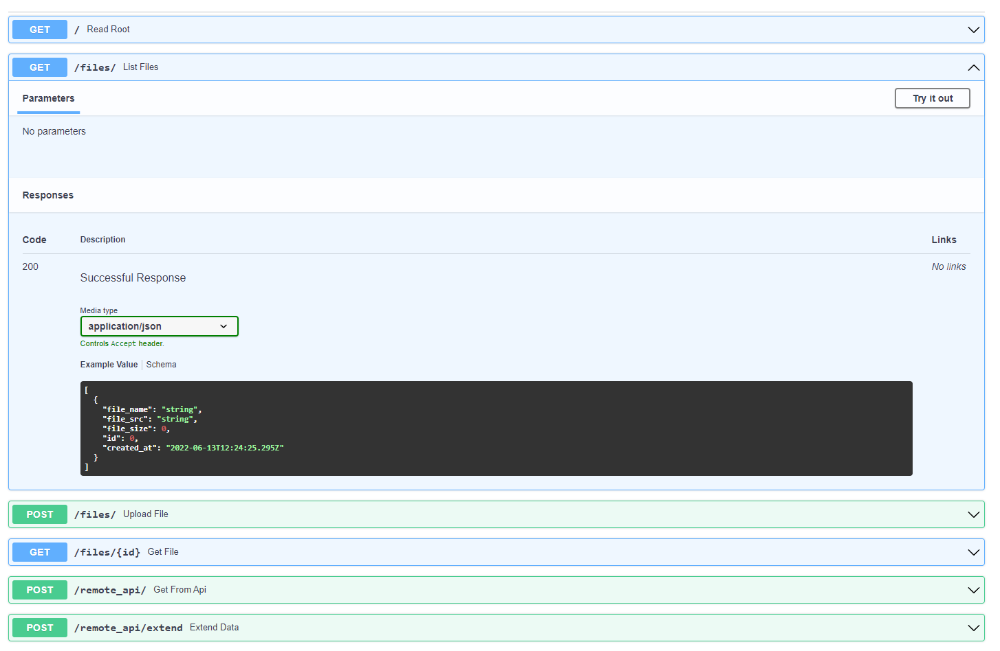
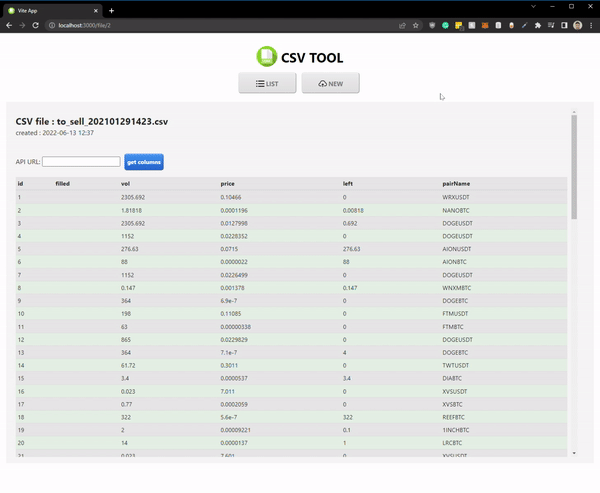
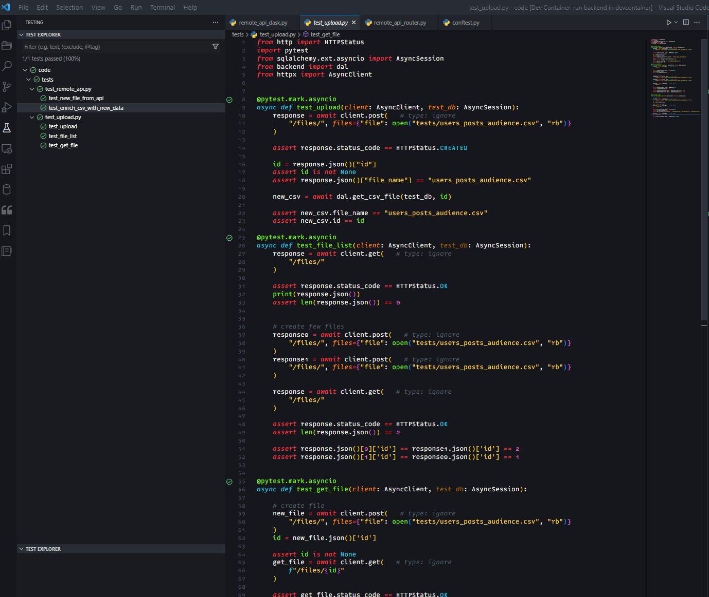

how to run:
```docker compose up```

for a first run we need to run db migrations : 
```docker compose run backend poetry run alembic upgrade head```

# BACKEND

 thank you for bootstraping the app, but I like this part, so I did it from the scratch. 
 I did choose fastAPI as it is simple and tightly coupled with pydantic and python typehints,
 and typed code is sooooo much better to work with.
 also it is build with asynchronous code in mind.

from "celery" in app requirements that you provided I figured out that it would be good to show that I know how to use some task schedulers, but because we are working with data, I decided to use dask - which allows us to do everything that celery is doing + do data operations like in pandas, but in a distributed way.


 files are stored as parquet files.

 all docker files and config is for developement only. 

properly typed fastapi (like this one), can produce openapi.json schema file, that can be integrated into frontend api calls, including the generation of typescript interfaces. unfortunately there wasn't time for that.

 # API
 to test api go to ```http://localhost:8080/docs```



# FRONTEND
simple react+typescript frontend app, I did try to keep it simple and minimalistic (without some big UI packages like antd or materialUI) 
instead CRA i did use vite as it utilizes esbuild (https://esbuild.github.io/), and equals build speed.
unfortunetly, I did not have time to do any tests or implement proper error handing in the frontend app.

app starts on ```localhost:3000```

project uses pnpm instead of npm



# TESTING
all endpoint are e2e tested using pytest


to run all tests run ```CI.sh```

# DEVELOPEMENT
all code was done in vs code. 
backend is configured to develop locally ( ```poetry install``` is all you need)

also (if you never tried - I encourage You, this is a fun experience) it can be developed using remote containers. 
all you need is https://code.visualstudio.com/docs/remote/containers-tutorial#_install-the-extension

also, if you open backend code inside vs code, it should ask you if You want to open it inside the container. 

# DEBUGGING
### backend
 *  you can connect with the debugger to any part of the backend code that is run by backend (configuration is already there) - it will work for local and dockerized development.

 * if you want to connect to dask part, you need to run worker with debugpy module in the same way, we are running the backend.

 * you can also debug tests, but some of them might require a connection to dask so it is best, to debug them inside the container.

 * vscode is configured to connect to db (dev and test)
* we can use a notebook to develop and test dask operations using Jupiter ( http://127.0.0.1:8888/lab )
* to see what is going on in dask, there is dashboard (http://localhost:8787/) where you can check workers / tasks / do some profiling


### frontend
 frontend app debugging should work with standard vscode chrome debugger.


# FILE STRUCTURE:
###backend
* .devcontainer - editor config to run editor inside container
* .vscode - editor configuration
* backend - app
    *   dask - dask config and functions for dask
    *   db  -   db config and models
    *   routes - app routes for files and remote api calls
    *   schemas - pydantic models
    *   config.py - config object used in whole app to store settings like db url
    *   dal.py - data abstraction layer functions - bunch of crud functions that takes pydantic model and output pydantic model, abstracting db part. thats should be first candidate for unittests
    * main.py - main file of the app. if ran, it should start dev server 
* migrations - alembic migrations for db (didnt create one pretty init migration, sry)
* tests - pytest config and tests 


###frontend
 * .vscode - editor configuration
 * components - some common shared components like "loading"
 * css - you guest it!
 * routes - components representing main routes in app
 * store - the only global state we need is the one that comes from api. I'm using react-query for managing loading/caching api calls and pure fetch (normally I would just get axios, but I did try to keep it minimal)
 * App.tsx - main components, including main menu and routing. it is keept is one component just because it is small, normally routing should go outside.

###storage
 * shared volume for csv files
### docker-postgresql-multiple-databases
* just for creating multiple db in postgress docker


# FUTURE IMPROVEMENTS

- file list pagination , filtering
- removing / renaming files
- cacheing
- csv file filtering / sorting 
- big files support (loading parts as you scroll them)
- authentication
- production builds


# FEW LAST WORDS
it didn't took 8 hours ;) I still not satisfied enought with the results but it has potential to scale and to add new features. 